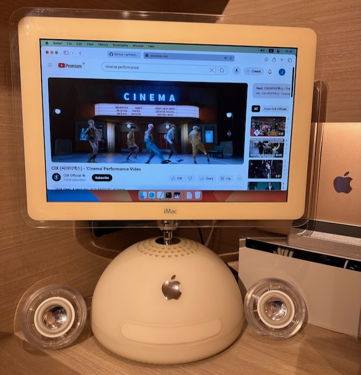
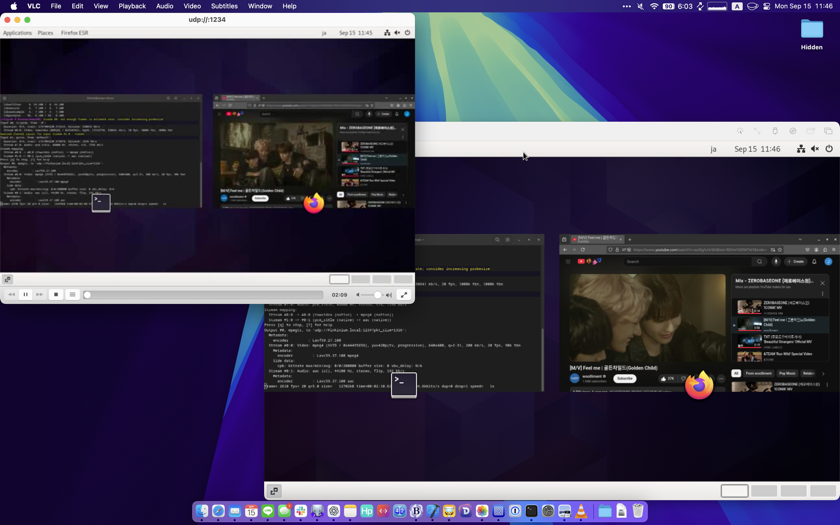
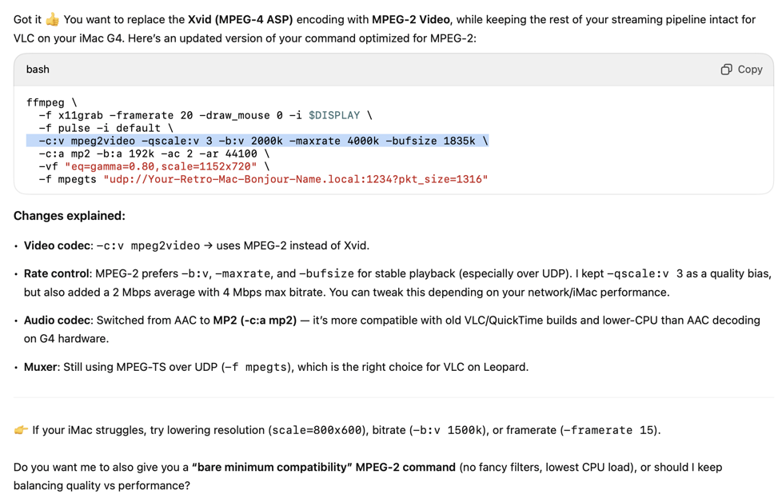

[](Images/000-Title/02-Title-Full.jpg)

# Retro Stream Tutorial

A tutorial on how to stream Youtube or any other video content to PowerPC Macs.
To see a video of the kind of quality you can expect,
[check this recording](https://drive.google.com/file/d/13i3V9a7xyKCAwo0-r4rAtxuz6pWQDmoB/view?usp=sharing)
on my Google Drive. I have noticed that the streaming quality from Google 
Drive directly is not always great, so download it to be sure you are seeing 
the full quality.

## Who Am I

I'm Jeff, a fan of Mac OS X, NeXT, a software developer, and general retro tech
enthusiast. I have other retro tech guides as well as software I have developed
for retro Macs, so please check it out.

- [MathEdit for OpenStep](https://github.com/jeffreybergier/MathEdit)
   - [MathEdit Development Posts on my Mastodon](https://jeffburg.social/tags/OpenStep)
- [Retro Software Update Tutorial](https://github.com/jeffreybergier/Retro-Software-Update-Tutorial)
- [iMac G4 Posts on my Mastodon](https://jeffburg.social/tags/iMacG4)
- [Homemade iMac 5K Monitor posts on my Mastodon](https://jeffburg.social/tags/iMac5K)

### My iMac G4 (Lamps Plus)

I recently got an iMac G4 and restored it with SSD and max RAM. I got this
machine because when I was in High School I desperately wanted one but could
never get it. But I didn't want to get it if it was going to sit on a shelf and
collect dust.

So before I bought it I tried this streaming setup to make sure it could work.
And I am very happy to report that I am happy with the results and this machine
now makes a great music video display for my KPOP listening enjoyment while I'm
working.

## Background

I am writing this in 2025 and I would say that it has been a good 10 years
since pretty much any computing device we may have can easily easily stream 
1080p and 4K content directly from the internet with absolutely no issues.

However, before 2015, this was not always the case. I will paste in specs
for the iPhone 5 and the original iPhone. You can see from the specs that 
even with special decoding hardware, the iPhone could only do 480p H.264.

iPhone 5 - 2012 \([Source](https://everymac.com/systems/apple/iphone/specs/apple-iphone-5-a1428-gsm-lte-4-17-north-america-specs.html)\):
> H.264 video up to 1080p, 30 frames per second

iPhone - 2007 \([Source](https://everymac.com/systems/apple/iphone/specs/apple-iphone-specs.html)\)
> H.264 video, up to 1.5 Mbps, **640 by 480 pixels**, 30 frames per second, 
> Low-Complexity version of the H.264 Baseline Profile

As another anecdote, I remember having a [1.67GHz PowerBook G4](https://everymac.com/systems/apple/powerbook_g4/specs/powerbook_g4_1.67_15_hr.html)
from late 2005 and being super amazed that it could rip DVD's into MPEG4 
format (not H.264 yet) at 1x meaning that it ONLY took 2 hours to rip a 2 hour 
DVD. This was incredible speed during this era.

So while we may feel like high-quality Youtube video playback has been a given
forever, it actually has not. And so when when we use old Macs we may get
frustrated by their inability to do "simple" tasks like play Youtube. But the
reason I am giving this background is to illustrate that this is no simple task.

### Why Can't Old Computers Play Youtube

1\) **[The TLS Apocalypse](https://oldvcr.blogspot.com/2020/11/fun-with-crypto-ancienne-tls-for.html)**: 
Means PowerPC macs can't connect to Youtube at all.

 - A few years ago, there was a big push for web servers to
   disable support for TLSv1.1 because there were fundamental flaws found in
   its cryptography. However, on pretty much any system older than 2015, 
   TLS v1.2 is not supported. If the web were working as expected, then these
   systems would just negotiate a TLSv1.1 or v1.0 connection. Hell, even 
   start the connection with no TLS for 90's system. But basically the entire
   internet decided that just rejecting the connection all together was better
   than allowing an insecure connection. So now what you see is any Mac running
   an OS older than macOS 10.9 Maverics (2013), basically can't browse the 
   internet at all.
   
2\) **H.264 is too Sophisticated**: Even if these Macs could connect to Youtube, 
H.264 is such a computationally intensive codec, that these old Macs can
barely play back postage stamp sized video in H.264.

 - H.264 was such a huge success because it meant extremely high quality 
   videos used very little bandwidth compared to its predecessors like Xvid
   and MPEG2. So while old Macs have not much trouble MPEG1, MPEG2, and Xvid, 
   we never got high quality videos back in the day because there was not
   enough bandwidth on the internet to get quality video out of these codecs.
   
### How to Stream High Quality Video on a PowerPC Mac

We are basically going to use the fact that we have a local high speed ethernet
network that our PowerPC Mac sits on to stream an incredibly high bit rate
yet simple to decode video codec like MPEG1, MPEG2, or Xvid. We are going 
to use so much bandwidth that even a modern internet connection would have 
trouble streaming this video over the internet (10+Mbps). 

The approach replaces the limited CPU power of PowerPC Macs and replaces it
with tons of bandwidth which they can handle thanks to their 10/100Mbps
ethernet ports.

### Known Limitations

#### Video Quality:

I want to be clear here that we are not going to get beautiful 4K content
playing on our PowerPC Macs. They just do not have enough power. But depending
on the system you have you will probably at least get:

- 720p video (480p on Tiger)
   - 1080p may be possible on fast G4's and G5's
- 20-30FPS
- Decently clear picture without too many blocky compression artifacts

#### Audio Quality

Audio quality is excellent. We get full AAC 192k or MP3 320k at 44,100Hz with
no issues. However, disabling audio will let you get higher video quality.
So if you are OK using your Apple Silicon Mac as the audio output device
(which may be preferred if you use Airpods for example), then you can push
the video codec further.

### System Requirements

1. PowerPC Mac running at least Mac OS X 10.4 Tiger (10.5 Leopard preferred)
   1. What about Jaguar? [VLC claims](https://www.videolan.org/vlc/download-macosx.html) 
      they have a version that supports 10.2 Jaguar but when I launched it on 
      10.2.8 it just crashed and I didn't try to troubleshoot at all. But 
      theoretically this would work on any version of OS X if you could get 
      VLC to start.
   1. Why is Leopard preferred? In the many hours of testing I have done, 
      Leopard seems to have a better networking stack that can handle 10+Mbps
      onslaught of UDP packets we are going to throw at the system. I was able
      to get almost double the resolution in Leopard (1152x720p) than I was
      able to in Tiger. But Tiger still works fine, just lower quality.
1. PowerPC Mac connected to your home network over ethernet: Sorry, the Airport
   cards on these old Macs are too slow for this.
1. Apple Silicon Mac: This will be the streaming server. Theoretically, any 
   computer that runs FFMPEG could be the streaming server. But this tutorial 
   is for Apple Silicon Macs.
   
#### My Setup

- [iMac (Flat Panel 17-inch, 1GHz)](https://everymac.com/systems/apple/imac/specs/imac_1.0_17_fp.html) from 2003 with SSD and 1.5GB RAM Upgrade
- [MacBook Air \(2020\)](https://everymac.com/systems/apple/macbook-air/specs/macbook-air-m1-8-core-8-core-gpu-13-retina-display-2020-specs.html) with M1 Chip and 16GB of RAM

### Tools

1. [UTM](https://mac.getutm.app) - A UI wrapper around the venerable QEMU virtualization and emulation tool
1. [Debian 12](https://www.debian.org) - You can use any Linux you like, but I found Debian 12 to be easiest
1. [FFMPEG](https://ffmpeg.org) - The one-stop-shop for all video encoding and decoding
1. [VLC](https://www.videolan.org/vlc/download-macosx.html) - The one-stop-shop for all video playback on OS X for 25 years

### Why Use a Virtual Machine

The [original version of this tutorial](README-MacVM.md) was entirely Mac based 
however, I still used a VM because  AVFoundation only lets FFMPEG capture
entire screens and I thought it was not very convenient to give an entire
monitor streaming. But primary, there is some sort of bug in FFMPEG that makes
capturing high quality audio via AVFoundation not work properly. I think its 
[Bug #11398](https://trac.ffmpeg.org/ticket/11398) but I'm not sure.

But as could be expected, FFMPEG works great with Linux. That said, I did many
many hours of troubleshooting and I found some critical things you need from
your Linux Video Streaming Server. So below is the easiest way I found to do
this. But you can use your own Linux server as long as:

- It runs X11: This is not the default for many years, but Ubuntu 25.10 drops X11 entirely
- It runs Pipewire 1.4.2: Debian 12 by default runs a very old version of Pipewire and it does not work properly for this streaming setup
- It supports hardware GPU acceleration

# Tutorial

I tried to add as many screenshots as possible. So if you are getting lost, 
use Command+F and search for Screenshot to highlight all of the screenshot 
links in the tutorial.

Also note that if you use the Debian VM image I link below, then copy and paste
works between the Host Mac and the VM Linux. However, remember that Linux uses
the Control key instead of command. Also, the terminal in Linux uses
Conotrol + Shift + C and Control + Shift + V

## Step 1: Prepare your Virtual Machine

1. Install [UTM](https://mac.getutm.app)
1. Open UTM - [Screenshot](Images/050-Debian/01-UTM-Blank.png)
1. Download the [Debian 12](https://mac.getutm.app/gallery/debian-12) image for UTM
1. Choose a place on your hard drive you want the VM image to live and move it there
1. Extract the Zip file - [Screenshot](Images/050-Debian/02-Debian-Extract.png)
1. Double click to open it in UTM - [Screenshot](Images/050-Debian/03-Debian-Open.png)
1. Click the "Edit Selected VM" in the toolbar at the top right of the UTM window
   1. \[Required\] In Network change the "Network Mode" to Bridged - [Screenshot](Images/050-Debian/04-UTM-Network.png)
   1. \[Optional\] In Display uncheck "Resize display to window size automatically" - [Screenshot](Images/050-Debian/05-UTM-Resolution.png) 
      1. This is a nice feature normally, but for our streaming server we never want the resolution to change
   1. \[Optional\] In USB Drive delete the USB CD-ROM Drive: We won't use it - [Screenshot](Images/050-Debian/06-UTM-CD.png)
   1. \[Optional\] In Sharing change the "Directory Sharing Mode" to None: We won't need to share files - [Screenshot](Images/050-Debian/07-UTM-Sharing.png)  
1. Boot up your VM
1. \[Required\] At the login window change to 1 of the Xorg (X11) options - [Screenshot](Images/050-Debian/08-Settings-X11.png)
   1. Username and Password are both `debian`
1. \[Optional\] Open the Settings app and change the following
   1. \[Optional\] Privacy→Screen - Disable screen blanking - [Screenshot](Images/050-Debian/09-Settings-ScreenBlank.png)
   1. \[Optional\] Users - Enable Automatic Login - [Screenshot](Images/050-Debian/10-Settings-Login.png)
   1. \[Optional\] Appearance - Enable Dark Mode - [Screenshot](Images/050-Debian/11-Settings-Appearance.png)
   1. \[Optional\] Date&Time - Set your time zone - [Screenshot](Images/050-Debian/12-Settings-TimeZone.png)
   1. \[Optional\] Keyboard - Add your keyboard if you don't use a US keyboard - [Screenshot](Images/050-Debian/13-Settings-Keyboard.png)
   1. \[Optional\] Mouse&Keyboard - Enable Natural Scrolling - [Screenshot](Images/050-Debian/14-Settings-Scrolling.png)
      1. If you are a Mac user you are probably used to natural scrolling at this point (no judgement 🤣)
   1. \[Optional\] Sharing - Change the system name - [Screenshot](Images/050-Debian/15-Settings-Name.png)
      1. If you want to use SSH to login to the VM: `ssh debian@Chosen-Sharing-Name.local`
1. Open FireFox and browse to Youtube to ensure your network and sound are working
1. Open Terminal and ping a Mac on your network (preferably not the host Mac) - `ping Retro-Mac-Bonjour-Name.local` 
   1. If the host is not reachable then there is a network issue (probably not bridged)
  
## Step 2: Install Updates

Sorry, some of these steps say to use `vi` in the terminal. You may need to 
look up how to use this text editor, its not easy. If there is another text
editor you already know how to use like `nano` feel free to use that instead.

**Install Updates from Debian Backports**

Debian 12 has many quite old pieces of software because Debian tries to maintain
a reputation of being stable. But they also offer "backports" which will install
newer versions of packages to your system. Specifically we need a much newer
version of Pipewire which is the audio system in Linux that FFMPEG will capture
from.

`sudo vi /etc/apt/sources.list`

At the bottom of the file, paste the following

`deb http://deb.debian.org/debian bookworm-backports main contrib non-free`

Save the file and exit, then update apt

`sudo apt update`

Now we need to tell apt to install all of the backport updates. This will tell
you there are 400+ updates needed, just confirm Yes. Note that it may present
some text files that give you info about the updates. If those appear, press `q`
to exit and allow the updates to install.

`sudo apt -t bookworm-backports upgrade`

Now we need to update any remaining updates

`sudo apt upgrade`

Now you can test to make sure a new version of pipewire is installed. The
version should be 1.4.2 but if its below 1, then we have a problem.

`pipewire --version`

Now you can restart the system

`sudo shutdown -r now`

## Step 2: Install FFMPEG

FFMPEG is a legendary tool for video and audio encoding, decoding, and 
streaming. In this tutorial I will probably only cover 1% of its functionality.
However, it gives us the power to tweak everything so we can stream to our
Retro Mac with unexpectedly good quality.

`sudo apt install ffmpeg pulseaudio-utils`

Set the default Pipewire audio capture device to be the "monitor". The default
capture device is usually the microphone, which makes sense, but is also not
what we want. I will give you the specific commands for my system, but be
careful to make sure the long names with numbers all match your system.

`pactl list short sources`

Now set the default to the device that ends in "monitor". Again, make sure
the name you type in matches your system if it happens to be different from
mine.

`pactl set-default-source alsa_output.pci-0000_00_03.0.analog-stereo.monitor`

## Step 3: Test Video Streaming to your Apple Silicon Mac

Because the Retro Mac might have other problems we can't control, first we are
going to try to stream video from the VM directly to your Apple Silicon
Mac Host. This will let us know the video streaming is working without worrying
about 20+ year old hardware and software.

**On the Host**

1. \[Host\] [Install VLC](https://www.videolan.org/vlc/download-macosx.html)
1. \[Host\] Open VLC and choose File→Open Network… and type in `udp://@:1234` - [Screenshot](Images/050-Debian/16-VLC-Open.png)
1. \[Host\] Now the host is waiting for a UDP stream from the VM

**On the VM**

Open terminal and paste the following. I'll explain the options later. But for
now the only thing you need to change is the bonjour name on the last line.

```
ffmpeg \
  -f x11grab -framerate 20 -draw_mouse 0 -i $DISPLAY \
  -f pulse -i default \
  -c:v mpeg4 -qscale:v 5 -vtag XVID \
  -c:a aac -b:a 192k -ac 2 -ar 44100 \
  -vf "scale=640x400" \
  -f mpegts "udp://Host-Mac-Bonjour-Name.local:1234?pkt_size=1316"
```

You should see that VLC on the host Mac is now playing video of the terminal on
the VM. So on the VM you can open FireFox and play a Youtube video. If the sound
comes through twice, then mute the audio in the VM by clicking on the menu item
at the top right of the screen.

To end the stream, type `q` in the terminal of the VM.



## Step 5: Prepare the PowerPC Mac

Note that for Leopard, the VLC website say you can use VLC 2.0.10 but I found
this version to have terrible performance. A search online revealed the same
thing. Instead you should use the newest version of 1.0 that you can find. 
Credit to [PowerPC Liberation: Video on PowerPC: Part 1 - Playback on G4/G5](https://powerpcliberation.blogspot.com/2012/08/video-on-powerpc-playback-on-g4g5.html)

Note that due to the [The TLS Apocalypse](https://oldvcr.blogspot.com/2020/11/fun-with-crypto-ancienne-tls-for.html)
mentioned above, you will almost certainly not be able to download these 
directly on the PowerPC Mac. Instead you will need to download them on your
modern Mac and then transfer them over file sharing.

**Install VLC on your Retro Mac**

1. On the Apple Silicon Mac: Download an old version of VLC
   1. Leopard: [VLC 1.1.12 from Macintosh Repository](https://www.macintoshrepository.org/11636-vlc-media-player) - [Screenshot](Images/040-PPC/01-PPC-Download-Leopard.png)
   1. Tiger: [VLC 0.9.10 from VLC Website](https://www.videolan.org/vlc/download-macosx.html) - [Screenshot](Images/040-PPC/02-PPC-Download-Tiger.png)
   1. Transfer the downloaded file to the PowerPC Mac via File Sharing
      1. New Macs can still connect to the AFP servers on old versions of OSX.
1. On the PowerPC Mac: Install and run VLC
   1. [Leopard Screenshot](Images/040-PPC/03-PPC-VLC-Leopard.png)
   1. [Tiger Screenshot](Images/040-PPC/04-PPC-VLC-Tiger.png)
1. On the PowerPC Mac: Get the Bonjour Name
   1. Note that this [used to be called Rendezvous](https://www.mactech.com/2004/07/22/apple-to-change-rendezvous-name-in-settlement/). 
      So you might see that name used instead of Bonjour in the UI.
   1. System Preferences→Sharing - [Leopard Screenshot](Images/040-PPC/05-PPC-Bonjour-Leopard.png)
   1. System Preferences→Sharing - [Tiger Screenshot](Images/040-PPC/06-PPC-Bonjour-Tiger.png)
1. On the PowerPC Mac: Open VLC and choose File→Open Network - type `udp://@:1234` - [Screenshot](Images/040-PPC/07-PPC-VLC-Open.png)
   1. Your PowerPC Mac is now waiting for the stream to start
1. (Optional) On the PowerPC Mac: Save the playlist for easy opening later - [Screenshot](Images/040-PPC/09-PPC-VLC-Save.png)
   
**Start the Video Stream in the Linux VM**

In the terminal paste the following. Note this is an extremely low quality 
stream. We are just making sure it works. We will optimize later.

```
ffmpeg \
  -f x11grab -framerate 20 -draw_mouse 0 -i $DISPLAY \
  -f pulse -i default \
  -c:v mpeg4 -qscale:v 10 -vtag XVID \
  -c:a aac -b:a 192k -ac 2 -ar 44100 \
  -vf "scale=640x400" \
  -f mpegts "udp://Your-Retro-Mac-Bonjour-Name.local:1234?pkt_size=1316"
```


## 🥳Congratulations🎉

You have a successful streaming setup completed. Now its time to optimize 
playback performance for your PowerPC Mac

# Optimize Playback Performance

All of my testing was done on my 1GHz iMac G4. But if you have a more powerful
Mac, you can get more bandwidth and quality out of it. Likewise, if you have 
a slower Mac, you can reduce quality.

To increase the speed of debugging, know that you can press Q to quit the
FFMPEG server and then change the settings and restart it again. The PowerPC 
Mac will just pause until you restart FFMPEG. Note that you can only change 
minor settings like framerate and quality settings. If you change resolution 
or codecs, then you will need to stop the stream on the PowerPC Mac and 
restart it.

## FFMPEG Commmand Explanation

Here is our example command which I find to have very quality and performance
on the iMac G4 1GHz. But based on your specific Mac, you may want to change
these settings.

```
ffmpeg \
  -f x11grab -framerate 20 -draw_mouse 0 -i $DISPLAY \
  -f pulse -i default \
  -c:v mpeg4 -qscale:v 3 -vtag XVID \
  -c:a aac -b:a 192k -ac 2 -ar 44100 \
  -vf "eq=gamma=0.80,scale=1152x720" \
  -f mpegts "udp://Your-Retro-Mac-Bonjour-Name.local:1234?pkt_size=1316"
```

### XVID Command Explanation

| Command                                                                  | Explanation |
|--------------------------------------------------------------------------|-------------|
| `ffmpeg`                                                                 |             |
| `-f x11grab -framerate 20 -draw_mouse 0 -i $DISPLAY \`                   | This specifies the video input - Modify the framerate to find the right balance between quality and performance |
| `-f pulse -i default \`                                                  | This specifies the audio input - The default capture device we specified earlier in this tutorial |
| `-c:v mpeg4 -qscale:v 3 -vtag XVID \`                                    | This specifies video codec (XVID) - Modify QSCALE from 1 (highest) to 31 (lowest) to find the right balance between quality and performance |
| `-c:a aac -b:a 192k -ac 2 -ar 44100 \`                                   | This specifies the audio codec (AAC) - If your Mac has trouble with AAC, you can change to MP3 |
| `-vf "eq=gamma=0.80,scale=1152x720" \`                                   | This specifies the video filter - You can do add many filters, but here we scale the video to be lower resolution and change the gamma to be darker (older Macs had a brighter gamma, so modern content can look washed out) |
| `-f mpegts "udp://Your-Retro-Mac-Bonjour-Name.local:1234?pkt_size=1316"` | This specifies the destination for the UDP stream (Your retro Mac) |

## Troubleshooting / Modifying FFMPEG Commands

I highly recommend using ChatGPT or another LLM to help you with FFMPEG. This is
where I learned everything for FFMPEG. I only use the free account and its
perfectly adequate. For example, here is a sample prompt and a screenshot of the
response. You can see that it exactly modified the one line that needed to
change.

> 
> Hi, I need help with FFMPEG. I am using Debian 12 with Backports installed to stream to an iMac G4 running Leopard and VLC. The iMac doesn't have much processor power and so I am trying to optimize performance. I have this FFMPEG command that streams in XVID and it plays pretty smoothly on my iMac, but I want to try MPEG2. Can you update the command to use MPEG2?
> 
> ffmpeg \
>   -f x11grab -framerate 20 -draw_mouse 0 -i $DISPLAY \
>   -f pulse -i default \
>   -c:v mpeg4 -qscale:v 3 -vtag XVID \
>   -c:a aac -b:a 192k -ac 2 -ar 44100 \
>   -vf "eq=gamma=0.80,scale=1152x720" \
>   -f mpegts "udp://Your-Retro-Mac-Bonjour-Name.local:1234?pkt_size=1316"
> 



# FAQ

1. Isn't this hard on a Retro Mac?
   1. Yeah, this is very hard on your old Mac. My iMac G4 can do it for hours
      with no stability challenges, but we are talking 100% CPU and many many 
      gigabytes of network traffic.
   1. This is more of a question on outlook of life than anything else. I 
      didn't get my retro Mac so it could sit on the shelf and look pretty. 
      They were meant to be used and so I wanted to use it as my
      secondary/background music screen.
1. Won't this slow down my Apple Silicon Mac?
   1. I have the absolute slowest Apple Silicon Mac. Its an M1 MacBook Air
      with no fan. Its true that this solution takes about 100% of 1 core of 
      the CPU. But I have not noticed any slow downs or throttling. This 
      includes when I am using Xcode to develop software for iOS and Mac apps.
1. There must be a way to get 44,100Hz sampling?
   1. I agree. This has been a big annoyance, but since I listen to the audio 
      on my Airpods anyway instead of through the stream, I haven't dove into
      more than a few hours.
   1. Perhaps if I used a Linux VM this would not be a problem? I also thought
      that it was because I was doing the audio recording in a VM... but I 
      did the exact same setup on the MacBook Air directly and it had the same 
      issue. So, not sure at all what the problem is.
1. Can this be done without an Apple Silicon Mac?
   1. Absolutely! The server could be any machine that runs FFMPEG which is 
      pretty much any machine. I look forward to seeing a future tutorial that 
      uses a Raspberry Pi 🍓
   1. I just created this tutorial using Virtual Buddy and Apple Silicon 
      because thats what I have. But there is no reason the exact same thing 
      can't be done with an Intel Mac and VMWare Fusion 
      (which is free now by the way)
   1. Also, a Virtual Machine is totally not needed. For example you could 
      get one of these [HDMI dummy plugs](https://www.amazon.com/Woieyeks-Virtual-Emulator-Headless-Supports/dp/B0CKKLTWMN/ref=sr_1_3?crid=2I5T3W67D1BIN&dib=eyJ2IjoiMSJ9.V54_l_dy5H-QDQPGm4g64-IB4nnDKf6MMnGSzGvNaa04HMqCrtl_czQuKDGjzR34HWrJ0t9lDaNQOTOnfdk6Kza_xoSY4_EpvtrPCd6MZzrWcPd6eXbIOZ4-kROOlNDpiB3sy7UaIzeBHIYQDTen3DneHtjS2mhbMYfVTxIo9lEHalFwkwXg7XSfYfZh79h9O-EWcOsyRawr2s1EyhAbp0LePhoqbrCzGr0P1Qhg5Io.hdRAftjL-y2y_Og7ss0CIH8VCx6QJecdZOSzQT2h7LM&dib_tag=se&keywords=HDMI%2BDummy%2BPlug&qid=1755416251&refresh=1&sprefix=hdmi%2Bdummy%2Bplug%2Caps%2C283&sr=8-3&th=1) 
      and use that "screen" as the capture device for FFMPEG/AVFoundation and 
      then use your PowerPC Mac as a second monitor for your main Mac. 
      My MacBook Air only supports one  external monitor, so I did not take 
      this approach.
1. Dedicating 4 Cores and 8GB of RAM to this VM seems excessive, no?
   1. I agree. After I got everything all set up and running, I lowered the 
      the CPU Cores to 2 and the RAM to 4GB and macOS Ventura still seems to 
      run fine and stream video with no issues.